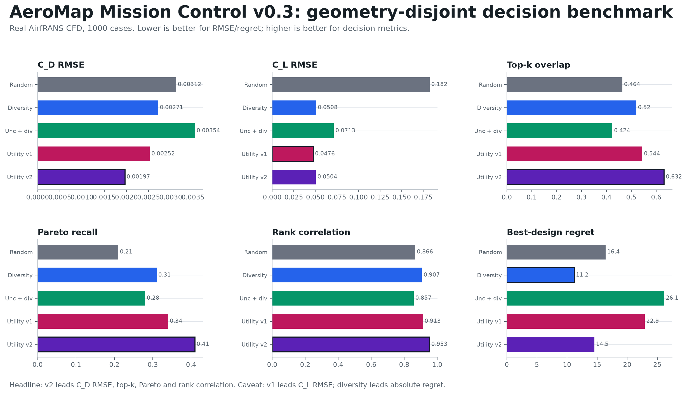
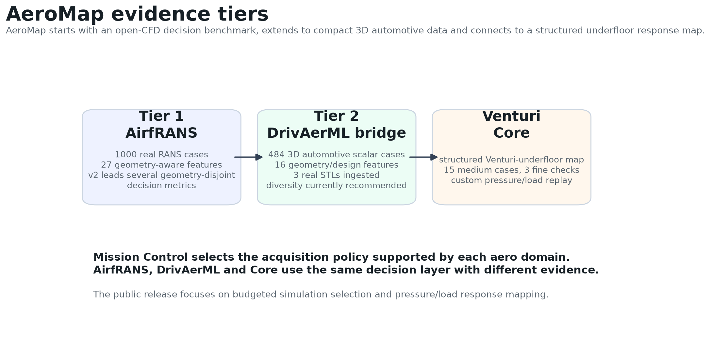
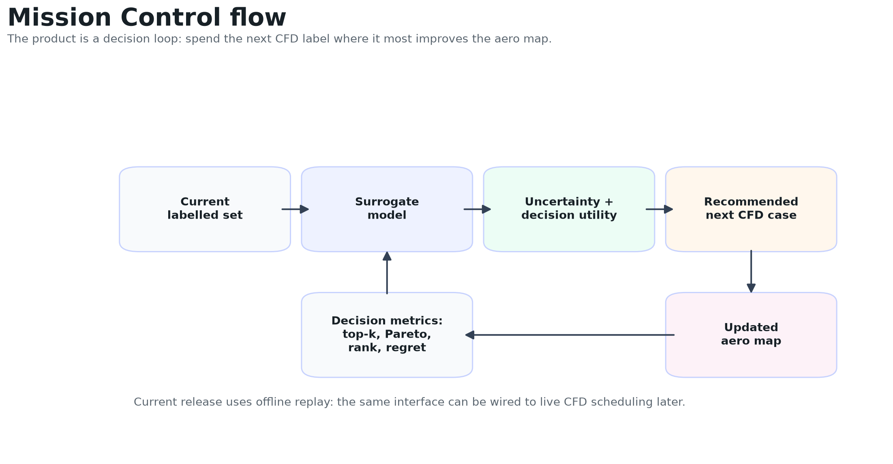
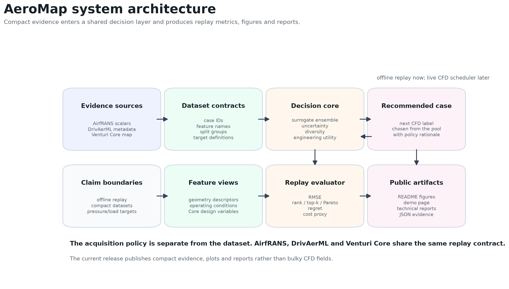
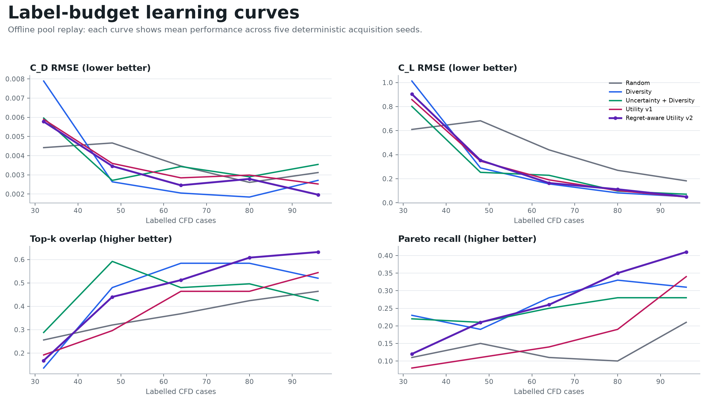
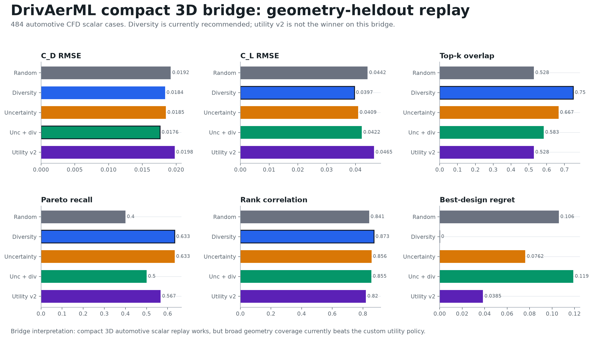
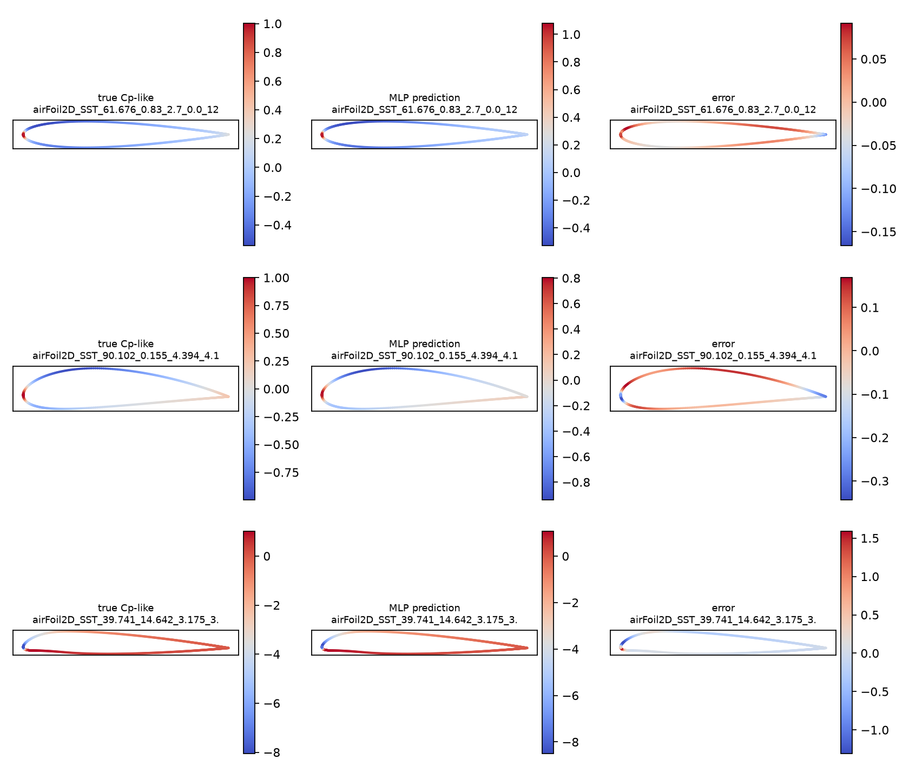
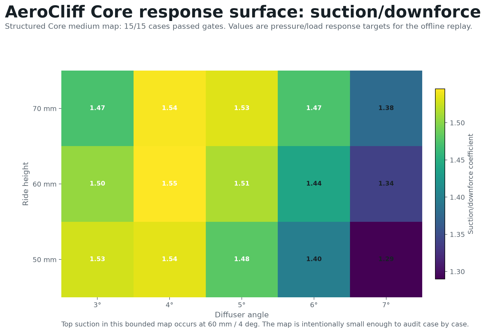
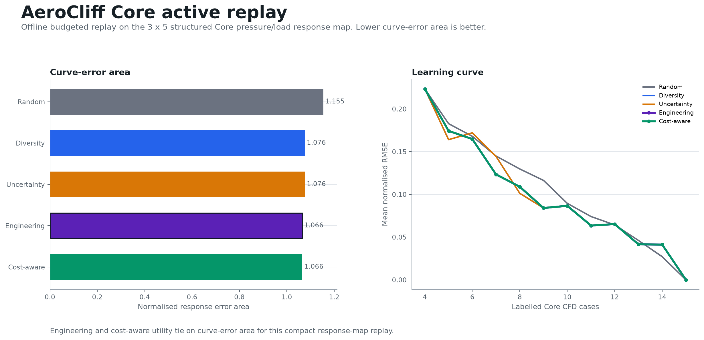

# AeroMap Mission Control

**AeroMap Mission Control is an active-learning system for aerodynamic maps under a limited CFD budget.**

It trains a surrogate on existing CFD cases, estimates where predictions are uncertain or important for design decisions, and recommends the next simulation to run. The current release demonstrates the workflow on AirfRANS, adds a compact DrivAerML 3D bridge, and connects the same loop to a structured Venturi-underfloor benchmark.



## Key result

On AirfRANS, a real open-CFD benchmark with 1,000 RANS cases, AeroMap uses geometry-aware features and a geometry-disjoint split over deterministic shape descriptors. The regret-aware acquisition policy leads the main design-decision metrics:

| Method | C_D RMSE | C_L RMSE | Top-k | Pareto | Rank | Regret |
|---|---:|---:|---:|---:|---:|---:|
| Random | 0.003119 | 0.182288 | 0.464 | 0.210 | 0.866 | 16.389 |
| Diversity | 0.002714 | 0.050832 | 0.520 | 0.310 | 0.907 | **11.195** |
| Utility v1 | 0.002525 | **0.047634** | 0.544 | 0.340 | 0.913 | 22.886 |
| Regret-aware utility v2 | **0.001966** | 0.050445 | **0.632** | **0.410** | **0.953** | 14.526 |

Practical reading: v2 is the best AirfRANS geometry-disjoint policy for drag error, top-k recovery, Pareto recall and ranking. Utility v1 is still best for lift RMSE; diversity is still best for absolute regret.

## What is in the repo

| Area | What it shows |
|---|---|
| AirfRANS decision benchmark | active learning on 1,000 real RANS cases with geometry-disjoint evaluation |
| DrivAerML bridge | compact 3D automotive metadata, scalar force targets and STL ingestion |
| AirfRANS field baseline | point-wise surface-pressure prediction on held-out CFD cases |
| Venturi Core | structured underfloor pressure/load response mapping and local replay/live loop |
| NASA hump methodology | OpenFOAM methodology pipeline on a recognised separated-flow validation case |



## How Mission Control works

```text
labelled CFD cases
        -> surrogate model
        -> uncertainty and engineering utility
        -> recommended next simulation
        -> updated aero map
```



The public architecture separates data contracts, acquisition policy, replay evaluation and output artifacts:



The benchmark reports decision metrics as well as RMSE:

- top-k design recovery;
- Pareto-front recall;
- lift/drag ranking;
- best-design regret;
- performance versus random, diversity and uncertainty baselines.



## Quick start

Install and run the checks:

```sh
uv sync
make lint
make test
```

Open the demo:

```sh
open docs/demo/aeromap_mission_control.html
```

## 3D automotive bridge

The DrivAerML bridge checks that the same decision loop can work beyond the 2D AirfRANS setting. It uses compact root metadata only: geometry parameters and integrated force/moment summaries.

| Bridge item | Result |
|---|---|
| Dataset | DrivAerML compact metadata |
| Cases | 484 |
| Features | 16 geometry/design parameters |
| Targets | `integrated_cd`, `integrated_cl` |
| Geometry sample | three cached DrivAerML STLs, about 753k triangles each |
| Recommended policy | diversity |



The bridge is deliberately lightweight: no volume fields, no boundary-field training and no cloud compute are needed for this replay.

## Cost-proxy extension

AeroMap v0.5 adds a bounded cost-aware check. AirfRANS uses observed local `internal.vtu` file size as a case-size proxy. DrivAerML uses a geometry-complexity proxy because full per-case solver cost is not available in the compact metadata.

Cost-aware utility selects the lowest cumulative proxy-cost labelled set in both replays and wins AirfRANS geometry-disjoint best-design regret. The original regret-aware v2 still leads most AirfRANS decision metrics, and diversity remains strongest on the DrivAerML bridge.

Details: [docs/reports/aeromap_cost_aware_v0_5_report.md](docs/reports/aeromap_cost_aware_v0_5_report.md)

## Field-level baseline

AeroMap now includes a small AirfRANS surface-pressure field baseline. It trains
a point-wise PyTorch MLP on airfoil surface coordinates, normals,
operating-condition features and compact geometry descriptors.

| Method | MAE | RMSE | NRMSE p95-p05 |
|---|---:|---:|---:|
| Train mean | 0.4558 | 0.7280 | 0.3701 |
| Nearest case | 0.1614 | 0.3281 | 0.1668 |
| Point-wise MLP | **0.0705** | **0.1183** | **0.0601** |

This is a compact field-target baseline. The useful part is the contract:
held-out surface-pressure targets, train-only normalisation, length-weighted
metrics and true/predicted/error maps.



Details: [docs/reports/airfrans_surface_pressure_field_baseline_v0_1.md](docs/reports/airfrans_surface_pressure_field_baseline_v0_1.md)

## Venturi Core response map

Venturi Core is a structured underfloor benchmark built to connect Mission Control to a custom ground-effect response problem. It maps pressure/load response over ride height and diffuser angle.

| Core result | Evidence |
|---|---|
| Response map | `3 x 5`: ride height `50/60/70 mm`, diffuser angle `3/4/5/6/7 deg` |
| Medium cases | `15 / 15` passed mesh, mass and force gates |
| Fine checks | `3 / 3` representative fine checks passed |
| Replay result | engineering utility and cost-aware utility tie for best curve-error area |
| Live/replay loop | model selects Core cases, committed evidence is ingested, map metrics update |





This Core tier gives the project a custom underfloor response surface while keeping the claim focused on pressure/load mapping.

The local live-loop MVP starts from three labelled Core cases, selects four more
cases with `engineering_utility`, ingests the committed Core evidence and updates
the response-map metrics after each selection. Diversity is still slightly best
by curve-error area on this small pool, while engineering utility and cost-aware
utility reduce error versus the averaged random baseline.

Details: [docs/reports/aerocliff_core_live_acquisition_loop.md](docs/reports/aerocliff_core_live_acquisition_loop.md)

## Reproduce the main results

Regenerate the release figures:

```sh
uv run python scripts/generate_aeromap_release_figures.py
```

Run the compact AirfRANS replay:

```sh
uv run aeromap benchmark aeromap-decision-replay-v03 \
  --config configs/benchmark/aeromap_mission_control_v03.yaml \
  --dataset-npz docs/evidence/aeromap/airfrans_geometry_scalar_dataset.npz \
  --out docs/evidence/aeromap/airfrans_decision_replay_v03.json \
  --svg-dir docs/evidence/aeromap
```

Run the AirfRANS surface-pressure field baseline from a materialised local
AirfRANS cache:

```sh
uv run aeromap benchmark airfrans-field-baseline \
  --root artifacts/benchmark/airfrans/processed
```

Run the compact DrivAerML bridge:

```sh
uv run aeromap benchmark aeromap-3d-triage \
  --out docs/evidence/aeromap3d/metadata_triage.json

uv run aeromap benchmark aeromap-3d-drivaerml-scalars \
  --cache-dir artifacts/benchmark/aeromap3d/drivaerml \
  --out docs/evidence/aeromap3d/drivaerml_scalar_bridge_dataset.json

uv run aeromap benchmark aeromap-decision-replay-v03 \
  --config configs/benchmark/aeromap_3d_bridge.yaml \
  --dataset-npz docs/evidence/aeromap3d/drivaerml_scalar_bridge_dataset.npz \
  --out docs/evidence/aeromap3d/drivaerml_scalar_bridge_replay.json \
  --svg-dir docs/evidence/aeromap3d
```

Run the Venturi Core response-map replay:

```sh
uv run scripts/run_venturi_core_2d_response_map_replay.py
```

Pass `--overwrite` only when you want to regenerate the OpenFOAM cases with
Docker rather than replaying the committed Core evidence.

Run the local Core live/replay acquisition loop:

```sh
uv run aeromap benchmark live-core-loop --max-iterations 4
```

## CFD methodology checks

These commands reproduce the NASA/TMR wall-mounted-hump methodology lane. It is mainly a CFD-process check: reference ingestion, OpenFOAM conversion, wall-field extraction and coefficient overlays.

Prepare the NASA/TMR hump methodology preflight:

```sh
uv run python scripts/prepare_nasa_hump_methodology.py
```

Materialise the local OpenFOAM conversion scaffold:

```sh
uv run python scripts/convert_tmr_nasa_hump_to_openfoam.py
```

Run and summarise the local SST smoke case:

```sh
uv run python scripts/run_nasa_hump_sst_smoke.py --overwrite
uv run python scripts/report_nasa_hump_sst_smoke.py
```

Details: [docs/reports/nasa_hump_sst_smoke_v0_1.md](docs/reports/nasa_hump_sst_smoke_v0_1.md)

Extract smoke-grid `C_p(x)` and `C_f(x)` overlays:

```sh
uv run python scripts/extract_nasa_hump_cp_cf.py
```

Details: [docs/reports/nasa_hump_cp_cf_extraction_v0_1.md](docs/reports/nasa_hump_cp_cf_extraction_v0_1.md)

Run and report the medium-grid SST candidate:

```sh
uv run python scripts/run_nasa_hump_medium_grid_sst.py --overwrite --end-time 200
uv run python scripts/report_nasa_hump_medium_grid_sst.py
```

Details: [docs/reports/nasa_hump_medium_grid_sst_v0_1.md](docs/reports/nasa_hump_medium_grid_sst_v0_1.md)

Methodology finding: [docs/reports/nasa_hump_methodology_finding_v0_1.md](docs/reports/nasa_hump_methodology_finding_v0_1.md)

## Repository map

| Path | Purpose |
|---|---|
| `src/aeromap/benchmarks/` | AeroMap, 3D bridge and cost-aware replay code |
| `src/aeromap/cfd/venturi_core.py` | structured Venturi Core case generation and metrics |
| `configs/benchmark/` | compact replay configs |
| `configs/cfd/venturi_core_*.yaml` | Core structured-grid configs |
| `scripts/prepare_nasa_hump_methodology.py` | NASA/TMR hump reference-ingest and mesh-policy preflight |
| `scripts/convert_tmr_nasa_hump_to_openfoam.py` | local OpenFOAM conversion scaffold for the NASA/TMR hump grid |
| `scripts/run_nasa_hump_sst_smoke.py` | local Docker/OpenFOAM SST smoke run |
| `scripts/report_nasa_hump_sst_smoke.py` | local OpenFOAM SST smoke evidence summary |
| `scripts/extract_nasa_hump_cp_cf.py` | smoke-grid NASA/TMR-style Cp/Cf extraction and overlay |
| `scripts/run_nasa_hump_medium_grid_sst.py` | local Docker/OpenFOAM SST run on the 409 x 109 NASA/TMR grid |
| `scripts/report_nasa_hump_medium_grid_sst.py` | medium-grid SST candidate overlay and claim-boundary report |
| `docs/assets/aeromap/` | public figures |
| `docs/demo/aeromap_mission_control.html` | no-server demo |
| `docs/reports/` | technical reports |
| `docs/evidence/` | compact committed evidence artifacts |

## Scope

This release is a local, reproducible aero-ML package. It covers AirfRANS scalar active learning, an AirfRANS surface-pressure baseline, a compact DrivAerML scalar bridge, the structured Venturi Core response map/live replay and a NASA/TMR hump methodology check. It does not require cloud compute.

Follow-on work:

- extend the Core loop from committed evidence ingestion to new local CFD case generation;
- add richer 3D field-level targets;
- extend Venturi Core toward live closed-loop simulation selection;
- continue the NASA hump setup diagnosis before any SA/SST model comparison;
- extend the custom underfloor lane toward higher-fidelity transfer studies.

## Datasets and citations

This repository uses compact, committed evidence derived from public datasets and open-source tooling. It does not redistribute the full upstream datasets.

| Source | How it is used here | Attribution |
|---|---|---|
| AirfRANS | 1,000-case open-CFD scalar benchmark for the main AeroMap active-learning replay and surface-pressure field baseline | AirfRANS: High Fidelity Computational Fluid Dynamics Dataset for Approximating Reynolds-Averaged Navier-Stokes Solutions. Dataset license: ODbL-1.0. See the [AirfRANS documentation](https://airfrans.readthedocs.io/en/latest/notes/introduction.html), [dataset description](https://airfrans.readthedocs.io/en/latest/notes/dataset.html), and [paper](https://arxiv.org/abs/2212.07564). |
| DrivAerML | Compact 3D automotive scalar bridge using root metadata and a small STL readiness sample | DrivAerML: High-Fidelity Computational Fluid Dynamics Dataset for Road-Car External Aerodynamics. Dataset license: CC BY-SA 4.0. See the [Hugging Face dataset](https://huggingface.co/datasets/neashton/drivaerml), [dataset page](https://neilashton.github.io/caemldatasets/drivaerml/), and [paper](https://arxiv.org/abs/2408.11969). |
| NASA/TMR wall-mounted hump | Separated-flow CFD methodology: reference ingestion, published SA/SST curve comparison, local OpenFOAM SST runs, Cp/Cf overlay extraction and a bounded 409 x 109 candidate | NASA/TMR 2D wall-mounted hump validation case and reference data. See the [case page](https://tmbwg.github.io/turbmodels/nasahump_val.html), [SA comparison](https://tmbwg.github.io/turbmodels/nasahump_val_sa.html), and [SST comparison](https://tmbwg.github.io/turbmodels/nasahump_val_sst.html). |
| OpenFOAM | CFD-oriented case structure, Venturi Core structured benchmark workflow, and NASA/TMR hump conversion scaffold | OpenFOAM is open-source CFD software distributed under GPL terms. See [openfoam.org licence](https://openfoam.org/licence/) and [openfoam.com licensing](https://www.openfoam.com/documentation/licencing). |
| NVIDIA DoMINO / PhysicsNeMo references | Architectural context for automotive surrogate and predictor workflows | See NVIDIA's [DoMINO Automotive Aero NIM overview](https://docs.nvidia.com/nim/physicsnemo/domino-automotive-aero/latest/overview.html), [NGC model page](https://catalog.ngc.nvidia.com/orgs/nim/teams/nvidia/containers/domino-automotive-aero), and [PhysicsNeMo DoMINO documentation](https://docs.nvidia.com/physicsnemo/25.11/physicsnemo/examples/cfd/external_aerodynamics/domino/README.html). |

## Verification

Current release checks:

```text
make lint
make test
GitHub Actions CI on main
```
