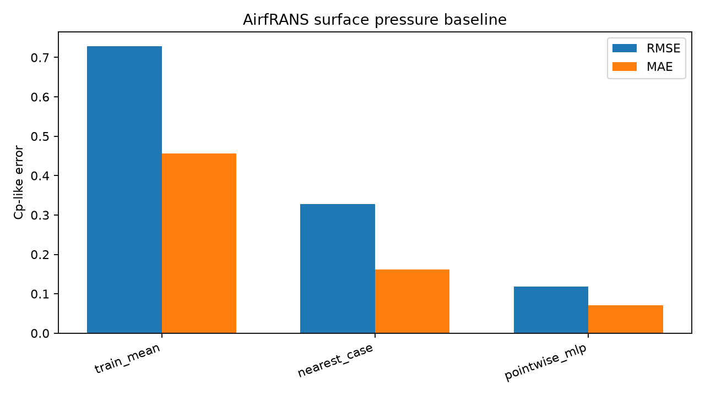

# AirfRANS Surface-Pressure Field Baseline v0.1

## Summary

This slice adds a small field-level neural-CFD baseline to AeroMap. It uses the
local AirfRANS VTK cache and trains a point-wise PyTorch MLP to predict
airfoil-surface pressure coefficient-like values on held-out CFD cases.

Classification:

```text
AEROMAP_AIRFRANS_SURFACE_PRESSURE_FIELD_BASELINE_V0_1
```

This is a baseline, not a neural-operator or DoMINO replacement. Its purpose is
to show that the repo can handle coordinate/normal/field-target pairing,
train/test separation, field metrics and held-out visualizations.

## Dataset

Source: AirfRANS processed VTK files.

Split:

| Split | Cases | Surface cells |
|---|---:|---:|
| Train | 80 | 80,494 |
| Validation | 16 | 16,121 |
| Test | 32 | 32,184 |

The split uses the AirfRANS `full_train` and `full_test` manifest entries.
The committed artifact stores hashes of the selected case IDs rather than
redistributing the VTK files.

## Field Contract

Surface file:

```text
<case>/<case>_aerofoil.vtp
```

Target:

```text
Cp_like = p / (0.5 * U_inf**2)
```

where `p` is `cell_data["p"]` from the AirfRANS aerofoil VTP and `U_inf` is
parsed from the case ID. This follows the AirfRANS package convention used when
normalising pressure in its boundary-layer helper with `compressible=False`.

Inputs:

- surface cell centre `x, y`;
- surface normal `n_x, n_y`;
- case operating-condition features;
- compact airfoil geometry descriptors.

Metrics are surface-length weighted using the VTP cell `Length` field.

## Models

Baselines:

| Method | Description |
|---|---|
| Train mean | length-weighted mean target over training surface cells |
| Nearest case | nearest training case in case-feature space, then nearest surface coordinate |
| Point-wise MLP | two-hidden-layer PyTorch MLP with fixed 80-epoch training |

The MLP uses train-only feature and target normalisation. Validation is reported
but not used for test tuning in this slice.

## Results

Held-out test metrics:

| Method | MAE | RMSE | NRMSE p95-p05 |
|---|---:|---:|---:|
| Train mean | 0.4558 | 0.7280 | 0.3701 |
| Nearest case | 0.1614 | 0.3281 | 0.1668 |
| Point-wise MLP | **0.0705** | **0.1183** | **0.0601** |

The MLP clears the two trivial baselines on the held-out test cases. The result
is useful because it demonstrates field-target learning and visualization, not
because the architecture is novel.

## Figures




## Claim Boundary

Allowed:

- field-level AirfRANS surface-pressure baseline;
- held-out AirfRANS test metrics;
- true/predicted/error visualizations;
- comparison against mean and nearest-case baselines.

Not claimed:

- F1 geometry;
- AeroCliff accuracy;
- DoMINO replacement;
- field-level state of the art;
- live CFD savings;
- full-volume prediction.

## Artifacts

- Evidence: `docs/evidence/field/airfrans_surface_pressure_baseline_v0_1.json`
- Visual panel: `docs/assets/aeromap/airfrans_surface_pressure_field_examples.png`
- Metrics plot: `docs/assets/aeromap/airfrans_surface_pressure_baseline_metrics.png`
