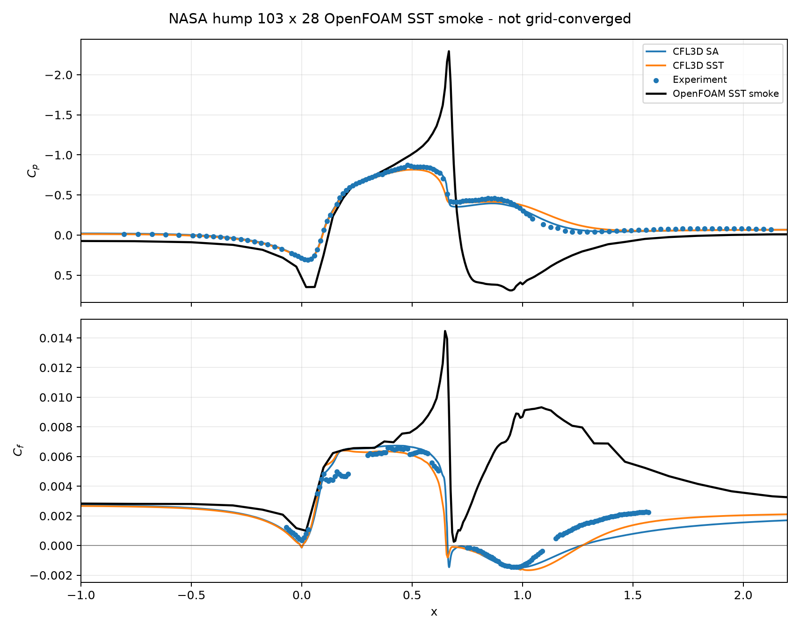

# NASA Hump Cp/Cf Extraction v0.1

## Result

The OpenFOAM SST smoke wall fields can be converted into NASA/TMR-style `C_p(x)` and `C_f(x)` curves. This is an extraction and overlay check, not a validation result.

| Item | Status |
|---|---|
| Classification | `OPENFOAM_NASA_HUMP_CP_CF_EXTRACTION_V0_1` |
| Wall samples | `102` |
| x-range | `-5.7487` to `3.7556` |
| OpenFOAM VTK | `artifacts/methodology/nasa_hump/sst_smoke_case/VTK/hump_wall/hump_wall_80.vtk` |
| Figure | `docs/assets/methodology/nasa_hump_cp_cf_overlay_v0_1.png` |

## Coefficient Contract

- OpenFOAM pressure is treated as incompressible kinematic pressure.
- `C_p = p / (0.5 * U_inf^2)`.
- `C_f`: `Cf = -wallShearStress_x / (0.5 * U_inf^2)`.
- `U_inf = 1.0` for this nondimensional smoke setup.

## C_f Sign Audit

Positive `C_f` is defined as wall shear acting in the local downstream wall-tangent direction of the external flow.

- Raw attached-region definition: `hump-wall cells with x < -2.0, falling back to first 20 percent if needed`.
- Raw attached-region samples: `6`.
- Raw OpenFOAM `wallShearStress_x` attached-region median: `-0.00160666`.
- Raw sign: `negative`.
- Audit status: `accepted_for_smoke_overlay_only`.

This v0.1 smoke extraction uses the global x-component after sign audit. A medium/fine correlation branch should project wall shear onto the local wall tangent.

## Smoke-Only Overlay Metrics

These are single-grid smoke metrics. They are not correlation-quality metrics.

| Reference | Cp RMSE | Cp MAE | Cf RMSE | Cf MAE |
|---|---:|---:|---:|---:|
| Experiment | 0.51106 | 0.33735 | 0.005257 | 0.004160 |
| CFL3D SST | 0.72463 | 0.56636 | 0.006072 | 0.004541 |
| CFL3D SA | 0.69106 | 0.53646 | 0.005895 | 0.004431 |

## Figure

## Claim Boundary

- Established: smoke-grid wall fields can be converted into `C_p(x)` and `C_f(x)` curves.
- Established: experiment and CFL3D overlays/metrics can be generated with fixed formulas.
- Not established: NASA validation accuracy, grid convergence, turbulence-model recommendation or production CFD methodology.

## Evidence

- JSON: `docs/evidence/methodology/nasa_hump_cp_cf_extraction_v0_1.json`
- Figure: `docs/assets/methodology/nasa_hump_cp_cf_overlay_v0_1.png`
