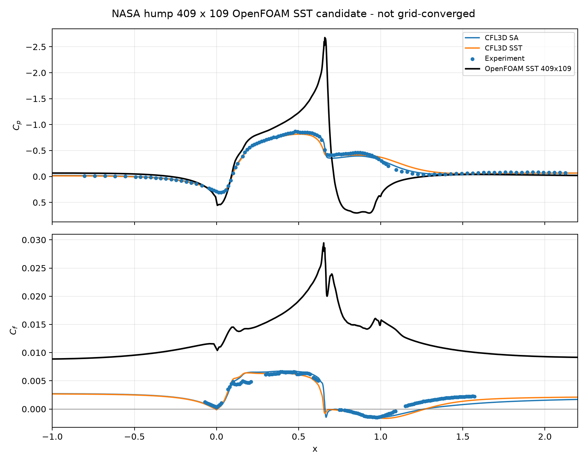

# NASA Hump Medium-Grid SST Candidate v0.1

## Result

The OpenFOAM SST pipeline has been rerun on the official 409 x 109 NASA/TMR no-plenum grid and processed through the same Cp/Cf overlay machinery. This is a medium-grid candidate, not a validation result.

| Item | Status |
|---|---|
| Classification | `OPENFOAM_NASA_HUMP_MEDIUM_GRID_SST_V0_1` |
| Case directory | `artifacts/methodology/nasa_hump/sst_medium_grid_case` |
| Grid | `artifacts/methodology/nasa_hump/raw/hump2newtop_noplenumZ409x109.p2dfmt.gz` |
| Cells | `44064` |
| Failed mesh checks | `2` |
| foamRun final time | `200.0` |
| OpenFOAM `C_f` zero crossings | `[]` |
| Correlation-plausible before SA branch | `False` |

## Coefficient Contract

- `C_p = p / (0.5 * U_inf^2)`.
- Main `C_f`: `Cf = -dot(wallShearStress, wall_tangent) / (0.5 * U_inf^2)`.
- Main `C_f` uses wall-shear projection onto the local downstream wall tangent.
- Global-x `C_f` is retained only as a diagnostic compatibility curve.

## Medium-Grid Candidate Overlay Metrics

These are medium-grid candidate metrics. They are not validation-quality metrics.

| Reference | Cp RMSE | Cp MAE | Cf RMSE | Cf MAE |
|---|---:|---:|---:|---:|
| Experiment | 0.54268 | 0.34030 | 0.012280 | 0.011884 |
| CFL3D SST | 0.75665 | 0.56120 | 0.015037 | 0.014061 |
| CFL3D SA | 0.72348 | 0.52862 | 0.014866 | 0.013952 |

## Assessment

Medium-grid SST is not yet correlation-plausible; further grid, boundary condition or numerics work is needed before model comparison.

## Figure

## Claim Boundary

- Established: the medium grid can be run through the local SST overlay pipeline.
- Established: wall-tangent `C_f` projection is implemented for the medium candidate.
- Not established: NASA validation accuracy, grid convergence, turbulence-model recommendation or production CFD methodology.
